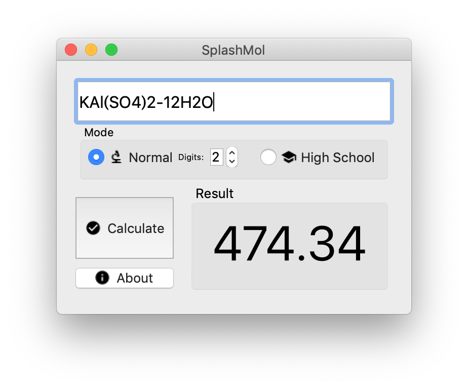

#  SplashMol
> A simple &amp; straight forward molecular mass calculator, written in Qt 5.
> Chiefly designed for high school students. Uses a (possibly buggy) simple bruteforce algorithm.

## Usage
Simply type in chemical formulas in their natural form, with subscripts replaced by normal numbers, then press Enter or click "Calculate". 

For formulas involving water of hydration (water of crystallization), use `-` as separator.

The app supports two calculation modes: Normal Mode and High School Mode. In Normal Mode,  all elements are supported and the results can be rounded to the precision you prefer (which can be chosen in the spin box next to it). In High School Mode, only a small range of elements are supported (They are: `C H O N P S K I Ba Au Ca Cl Na Mg Al Si Mn Fe Cu Zn Ag Hg`) and their atomic mass are all rounded to their typical value used in high school chemistry calculations.

Please note that all elements are case sensitive.

**Examples:**
`Ca(OH)2`
`Cu2(OH)2CO3`
`NH4OH`
`CCl4`
`AgCl`
`CuSO4-5H2O`
`KAl(SO4)2-12H2O`

## Screenshot

## Known Bugs & Limitations 
- **Multiple (>1) layers of parentheses are currently not supported.** This will be implemented later down the road.
- Only `-` instead of `·` is supported in formulas involving water of hydration due to issues with `utf-8` in code; ~~Both separators would be supported in the future.~~ *due to limitations of `QString` and `QChar`, this should be a wontfix for a period of time.*
- Button icons appear to be blurry.
- [macOS Only] The styles of both  "Calculate"  and  "About" buttons are different.

Please note that all of those problems won't cause runtime errors; they'll be automatically ignored though the result might be wrong.  
## TODO
- [ ] Rewrite frontend using QML and adapt Material Design
- [ ] Improve algorithm & solve the problems listed above.
- [ ] Design a new icon & adapt them in macOS
- [x] ~~Publish prebuilt binaries for Windows, macOS and Linux.~~
- [ ] Port the app to Android 
- [ ] ...more?

## Changelog

See [Releases](https://github.com/CRH6F-A-0464/splashmol/releases).

## Credits

Written with <3 by CRH6F-A-0464

Huge thanks to members in the [@cpluspluszh](https://t.me/cpluspluszh) Telegram group for guidance. I learned a lot through them.